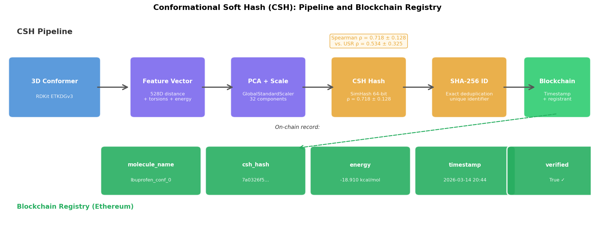
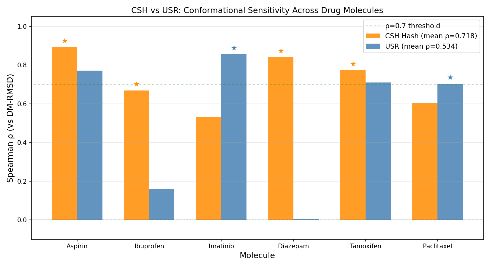
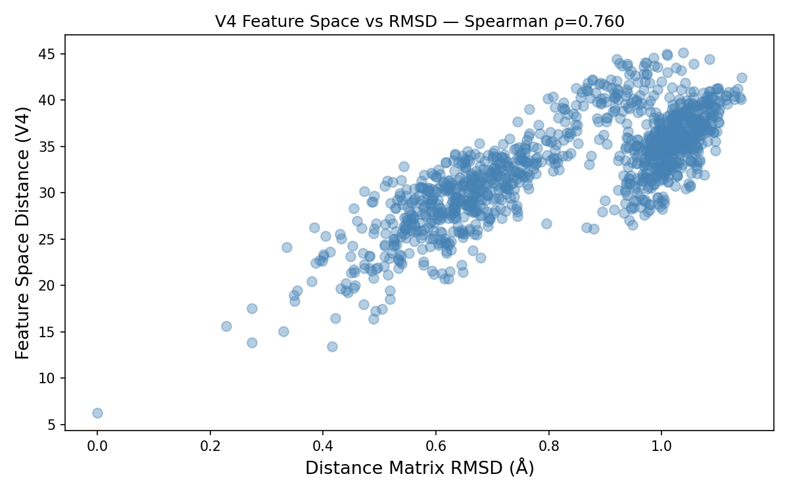

# Conformational Soft Hash (CSH)

A rotation-invariant molecular fingerprint for conformation-sensitive similarity search with blockchain-based conformational registry.

## Overview

Standard molecular fingerprints (e.g. Morgan/ECFP) are **blind to molecular conformation** — they produce identical hashes for all conformers of the same molecule. CSH solves this by encoding 3D geometry directly into a compact hash that:

- Is **invariant to rotation and translation** (based on pairwise distance matrix)
- Is **sensitive to conformational changes** (Spearman ρ = 0.718 ± 0.128 vs DM-RMSD)
- **Outperforms USR** (Ultrafast Shape Recognition) on average across 6 drug molecules
- Enables **tamper-proof conformational registry** via Ethereum smart contract



## Results

### Benchmark: CSH vs USR across 6 drug molecules



| Molecule | Atoms | CSH ρ | USR ρ |
|----------|-------|-------|-------|
| Aspirin | 21 | **0.892** | 0.772 |
| Ibuprofen | 33 | **0.669** | 0.161 |
| Imatinib | 68 | 0.530 | **0.855** |
| Diazepam | 33 | **0.840** | 0.004 |
| Tamoxifen | 57 | **0.772** | 0.710 |
| Paclitaxel | 95 | 0.604 | **0.703** |
| **Mean** | | **0.718 ± 0.128** | 0.534 ± 0.325 |

CSH achieves consistent conformational sensitivity across molecules of varying size and complexity. USR fails completely for rigid aromatic systems (Diazepam ρ = 0.004).

### Feature Space Validation



Feature space Spearman ρ = 0.760 (Ibuprofen), 0.862 (Imatinib) vs rotation-invariant DM-RMSD.

## Pipeline

```
3D Conformer (RDKit ETKDGv3)
        ↓
Pairwise distance matrix (528D for ibuprofen)
+ Torsion angles (sin/cos encoded)
+ MMFF94 energy
        ↓
GlobalStandardScaler + PCA (32 components)
        ↓
SimHash (64-bit) → CSH Hash   ← similarity search
SHA-256           → Exact ID  ← blockchain registry
        ↓
Ethereum smart contract (ConformationalRegistry.sol)
Timestamp + registrant address → proof-of-conformational-search
```

## Installation

```bash
# Python dependencies
conda activate your-env
conda install -c conda-forge rdkit
pip install scikit-learn scipy web3

# Blockchain (optional)
cd hardhat
npm install
npx hardhat node  # start local Ethereum node
npx hardhat run scripts/deploy.js --network localhost
```

## Usage

```python
from conformational_soft_hash import ConformationalSoftHash
from rdkit import Chem
from rdkit.Chem import AllChem

# Generate conformers
mol = Chem.MolFromSmiles("CC(C)Cc1ccc(cc1)C(C)C(=O)O")  # Ibuprofen
mol = Chem.AddHs(mol)
AllChem.EmbedMultipleConfs(mol, numConfs=10, params=AllChem.ETKDGv3())
AllChem.MMFFOptimizeMoleculeConfs(mol)

# Hash all conformers
csh = ConformationalSoftHash()
results = csh.hash_all_conformers(mol)

for r in results:
    print(f"Conf {r['conf_id']}: LSH={r['lsh_hash']} SHA256={r['sha256_id'][:16]}...")
```

## Blockchain Registry

```python
from web3 import Web3
# Connect to local Hardhat node
w3 = Web3(Web3.HTTPProvider("http://127.0.0.1:8545"))

# Register conformer hash on-chain
# See blockchain_registry.py for full implementation
```

Each registered conformer includes:
- CSH hash (for similarity search)
- SHA-256 ID (exact deduplication)
- MMFF94 energy
- Registrant Ethereum address
- Block timestamp (immutable proof-of-search)

## Repository Structure

```
├── Blockchain.ipynb              # Main notebook with full pipeline
├── conformational_soft_hash.py   # Core CSH implementation
├── blockchain_registry.py        # Web3.py client for smart contract
├── ConformationalRegistry.sol    # Ethereum smart contract
├── hardhat/
│   ├── contracts/                # Solidity contracts
│   └── scripts/deploy.js         # Deployment script
├── csh_vs_usr_comparison.png     # Figure 2: benchmark results
├── csh_pipeline_figure3.png      # Figure 3: pipeline diagram
└── spearman_v4.png               # Figure 1: feature space validation
```

## Key Dependencies

- [RDKit](https://www.rdkit.org/) — molecular informatics
- [scikit-learn](https://scikit-learn.org/) — PCA, StandardScaler
- [web3.py](https://web3py.readthedocs.io/) — Ethereum interaction
- [Hardhat](https://hardhat.org/) — Ethereum development environment

## Citation

If you use this code in your research, please cite:

```
Hryc, J. (2026). Conformational Soft Hash (CSH): A Rotation-Invariant 
Molecular Fingerprint for Conformation-Sensitive Similarity Search and 
Blockchain-Based Conformational Registry. [preprint]
```

## Author

**Jakub Hryc**  
Department of Computational Biophysics and Bioinformatics  
Jagiellonian University, Kraków, Poland  
[ORCID: 0000-0002-6182-4500](https://orcid.org/0000-0002-6182-4500)  
[LinkedIn](https://www.linkedin.com/in/jakub-hryc-a6abb315a/)

## License

MIT License — see [LICENSE](LICENSE) for details.
